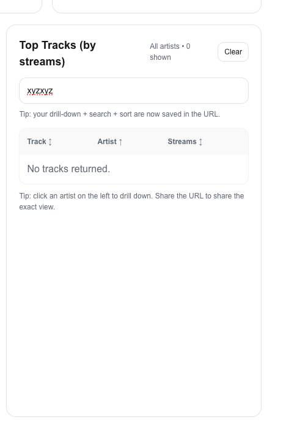

# 🎵 Music Top 100 Analytics Dashboard

A production-style analytics dashboard built with **Next.js (App Router)** and **TypeScript**, designed to mirror the type of internal analytics tools used by data and content teams at companies like Netflix.

The application analyzes Spotify Top 100 streaming data and surfaces insights through KPI metrics, artist-level drill-downs, and interactive tables with URL-driven state.

---

## 🚀 Project Overview

This project demonstrates how raw music streaming data can be transformed into a **decision intelligence product**.  
It focuses on analytics engineering principles: data aggregation, stateful UI design, performance-conscious rendering, and clear insight delivery.

The dashboard allows users to:
- Understand overall catalog scale and engagement
- Identify top-performing artists by total streams
- Drill into individual artists to explore track-level performance
- Filter and sort results dynamically
- Share reproducible views via URL parameters

---

## 📊 Core Features

### KPI Metrics
- **Total Tracks**
- **Unique Artists**
- **Total Streams (formatted at scale)**

### Interactive Analytics
- Clickable **artist drill-down** from chart to table
- Dynamic **search and filtering** of tracks
- Multi-column **sorting** (track, artist, streams)
- Graceful **empty-state handling**

### Analytics UX Patterns
- URL-synced state for filters and sorting
- Clear separation between server-side aggregation and client-side interaction
- Responsive, readable layout optimized for analysis

---

## 🧠 Example Interactions

### Artist Drill-Down
Clicking an artist filters the track table in real time.

---

### Search & Filter
Track-level search enables focused analysis.

---

### Empty State Handling
Edge cases are handled cleanly to preserve UX integrity.

---

## 🔌 Backend API Design

All metrics and aggregations are powered by a custom API endpoint:

